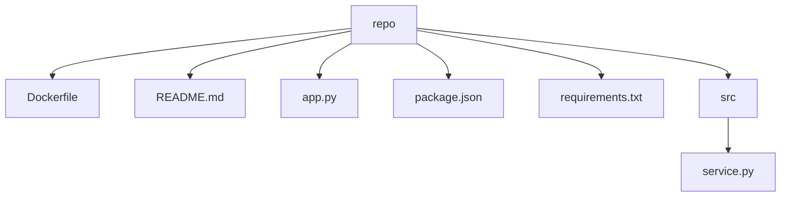

# Code Study Notes: sample-python-service

- Repository: `/tmp/sample-python-service`
- Generated at: 2026-05-21 00:00 UTC
- Files scanned: 6
- Approx size: 3.2 KB

## Project Overview

This repository contains 6 scanned files. The dominant detected language is Python. The analyzer found 3 configuration files and 2 likely entry points.

## Technology Stack

- Python: 2 files (40.0%)
- Markdown: 1 files (20.0%)
- JSON: 1 files (20.0%)
- Docker: 1 files (20.0%)

## Key Configuration

- `requirements.txt` (requirements.txt)
  - dependencies: fastapi, uvicorn, pytest
- `package.json` (package.json)
  - package name: docs-ui
  - scripts: dev, test
- `Dockerfile` (Dockerfile)
  - CMD ["python", "app.py"]

## Likely Entry Points

- `app.py`: conventional entry filename: app.py
- `Dockerfile`: CMD ["python", "app.py"]

## Directory Structure

```text
|-- Dockerfile
|-- README.md
|-- app.py
|-- package.json
|-- requirements.txt
`-- src
    `-- service.py
```

## Module Relationship Sketch



## Core Files To Read

- `requirements.txt`
- `package.json`
- `Dockerfile`
- `app.py`
- `src/service.py`

## Suggested Reading Route

1. Read project overview first: README.md
2. Review configuration and dependency files: requirements.txt, package.json, Dockerfile
3. Trace likely runtime entry points: app.py, Dockerfile
4. Open core modules next: requirements.txt, package.json, Dockerfile, app.py, src/service.py
5. Skim tests, examples, and CI files to understand expected behavior.

## Guessed Run Commands

- `npm install`
- `npm run dev`
- `npm test`
- `python -m pip install -r requirements.txt`
- `python app.py  # or python main.py`
- `docker build -t app . && docker run --rm app`

## Follow-Up Questions

- What user problem does this repository solve, and where is that documented?
- Which configuration file defines the canonical way to run and test the project?
- Where does control flow enter the application, and what modules does it call first?
- Why does the project use multiple languages, and where is each language boundary?
