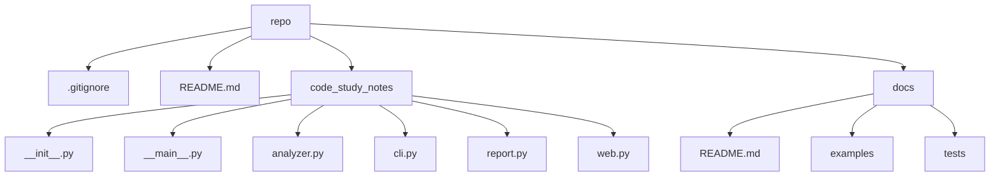

# Code Study Notes: code-study-notes-repo

- Repository: `/root/code-study-notes-repo`
- Generated at: 2026-05-21 08:24 UTC
- Files scanned: 11
- Approx size: 32.5 KB

## Project Overview

This repository contains 11 scanned files. The dominant detected language is Python. The analyzer found 0 configuration files and 1 likely entry points.

## Technology Stack

- Python: 7 files (70.0%)
- Markdown: 3 files (30.0%)

## Key Configuration

- No standard configuration files were detected.

## Likely Entry Points

- `code_study_notes/__main__.py`: conventional entry filename: __main__.py

## Directory Structure

```text
|-- .gitignore
|-- README.md
|-- code_study_notes
|   |-- __init__.py
|   |-- __main__.py
|   |-- analyzer.py
|   |-- cli.py
|   |-- report.py
|   `-- web.py
`-- docs
    |-- README.md
    |-- examples
    |   `-- sample-report.md
    `-- tests
        `-- smoke_test.py
```

## Module Relationship Sketch



## Core Files To Read

- `code_study_notes/__main__.py`
- `code_study_notes/__init__.py`
- `code_study_notes/analyzer.py`
- `code_study_notes/cli.py`
- `code_study_notes/report.py`
- `code_study_notes/web.py`
- `docs/tests/smoke_test.py`

## Suggested Reading Route

1. Read project overview first: README.md
2. Trace likely runtime entry points: code_study_notes/__main__.py
3. Open core modules next: code_study_notes/__main__.py, code_study_notes/__init__.py, code_study_notes/analyzer.py, code_study_notes/cli.py, code_study_notes/report.py, code_study_notes/web.py, docs/tests/smoke_test.py
4. Skim tests, examples, and CI files to understand expected behavior.

## Guessed Run Commands

- `Look for README instructions or scripts in configuration files.`

## Follow-Up Questions

- What user problem does this repository solve, and where is that documented?
- Which configuration file defines the canonical way to run and test the project?
- Where does control flow enter the application, and what modules does it call first?
- Why does the project use multiple languages, and where is each language boundary?
- No standard dependency files were found; how are dependencies installed?
