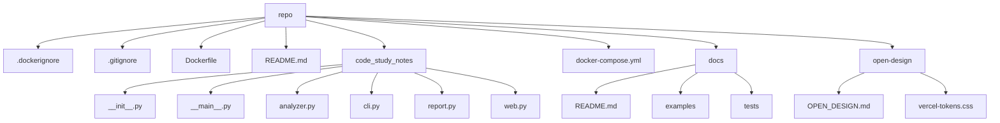

# Code Study Notes: code-study-notes-repo

- Repository: `/root/code-study-notes-repo`
- Generated at: 2026-05-21 08:45 UTC
- Files scanned: 16
- Approx size: 51.0 KB

## Project Overview

This repository contains 16 scanned files. The dominant detected language is Python. The analyzer found 2 configuration files and 2 likely entry points.

## Technology Stack

- Python: 7 files (50.0%)
- Markdown: 4 files (28.6%)
- YAML: 1 files (7.1%)
- Docker: 1 files (7.1%)
- CSS: 1 files (7.1%)

## Key Configuration

- `Dockerfile` (Dockerfile)
  - CMD ["python", "-m", "code_study_notes", "web", "--host", "0.0.0.0", "--port", "8765", "--out", "/app/out"]
- `docker-compose.yml` (docker-compose.yml)

## Likely Entry Points

- `code_study_notes/__main__.py`: conventional entry filename: __main__.py
- `Dockerfile`: CMD ["python", "-m", "code_study_notes", "web", "--host", "0.0.0.0", "--port", "8765", "--out", "/app/out"]

## Directory Structure

```text
|-- .dockerignore
|-- .gitignore
|-- Dockerfile
|-- README.md
|-- code_study_notes
|   |-- __init__.py
|   |-- __main__.py
|   |-- analyzer.py
|   |-- cli.py
|   |-- report.py
|   `-- web.py
|-- docker-compose.yml
|-- docs
|   |-- README.md
|   |-- examples
|   |   `-- sample-report.md
|   `-- tests
|       `-- smoke_test.py
`-- open-design
    |-- OPEN_DESIGN.md
    `-- vercel-tokens.css
```

## Module Relationship Sketch



## Core Files To Read

- `Dockerfile`
- `docker-compose.yml`
- `code_study_notes/__main__.py`
- `code_study_notes/__init__.py`
- `code_study_notes/analyzer.py`
- `code_study_notes/cli.py`
- `code_study_notes/report.py`
- `code_study_notes/web.py`
- `docs/tests/smoke_test.py`

## Suggested Reading Route

1. Read project overview first: README.md
2. Review configuration and dependency files: Dockerfile, docker-compose.yml
3. Trace likely runtime entry points: code_study_notes/__main__.py, Dockerfile
4. Open core modules next: Dockerfile, docker-compose.yml, code_study_notes/__main__.py, code_study_notes/__init__.py, code_study_notes/analyzer.py, code_study_notes/cli.py, code_study_notes/report.py, code_study_notes/web.py
5. Skim tests, examples, and CI files to understand expected behavior.

## Guessed Run Commands

- `docker compose up --build`
- `docker build -t app . && docker run --rm app`

## Follow-Up Questions

- What user problem does this repository solve, and where is that documented?
- Which configuration file defines the canonical way to run and test the project?
- Where does control flow enter the application, and what modules does it call first?
- Why does the project use multiple languages, and where is each language boundary?
